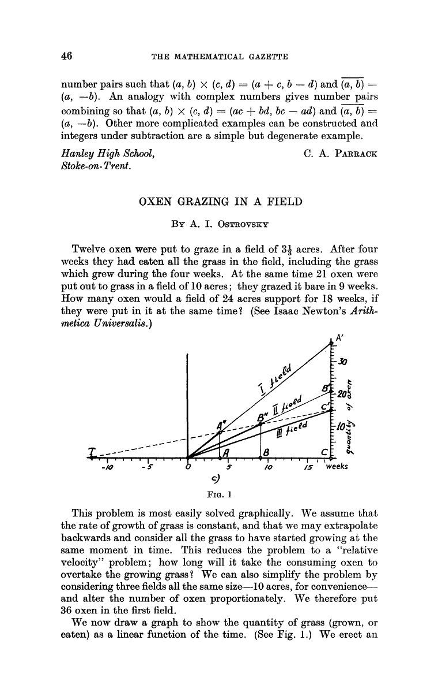

# 牛吃草（牛顿问题）

## 题解

有一块牧场，可供10头牛吃20天，15头牛吃10天，则它可供25头牛吃多少天？

很容易注意到，`10 x 20 != 15 x 10`。为什么？因为每天都有草长出来。这也是此题的关键。

`每天新长草量 = (较少牛数 × 较多天数 - 较多牛数 × 较少天数) ÷ (较多天数 - 较少天数)`

从量纲上看，上面的结果单位是`“牛”`。可以理解为，每天草增量相当于几头牛的食量。

`每天新长草量 = (10牛 x 20天) – (15牛 x 10天) / (20天 – 10天) = 5牛`

`草地原有草量 = (牛数 - 每天新长草量) × 吃草天数`，单位是`“牛天”`

`(10牛 – 5牛) x 20天 = 100牛天`

`(15牛 – 5牛) x 10天 = 100牛天`

两种方法算出来结果是一样的。

25 头牛的情况下，可以吃多少天？把上面公式反过来用：

`100牛天 / (25牛 – 5牛) = 5天`

可以这么理解：草总量是100牛天，每天安排5牛专吃草增量，剩下20牛专吃草存量。

练习：

（07浙江A-24.C）林子里有猴子喜欢吃的野果，23只猴子可以在9周内吃光，21只猴子可以在12周内吃光，问如果有33只猴子一起吃，则需要几周吃光？（假定野果生长的速度不变）
* A. 2周
* B. 3周
* C. 4周
* D. 5周

（13国考-68.B）某河段中的沉积河沙可供80人连续开采6个月或60人连续开采10个月。如果要保证该河段河沙不被开采枯竭，问最多可供多少人进行连续不间断的开采（假定该河段河沙沉积的速度相对稳定）
* A. 25
* B. 30
* C. 35
* D. 40

（18深圳-46.B）某轮船发生漏水事故，漏洞处不断地匀速进水，船员发现险情后立即开启抽水机向外抽水。已知每台抽水机每分钟抽水20立方米，若同时使用2台抽水机15分钟能把水抽完，若同时使用3台抽水机9分钟能把水抽完。当抽水机开始向外抽水时，该轮船已进水（ ）立方米。
* A. 360
* B. 450
* C. 540
* D. 600

(19联A-13.D) 某河道由于淤泥堆积影响到船只航行安全，现由工程队使用挖沙机进行清淤工作，清淤时上游河水又会带来新的泥沙。若使用1台挖沙机300天可完成清淤工作，使用2台挖沙机100天可完成清淤工作。为了尽快让河道恢复使用，上级部门要求工程队25天内完成河道的全部清淤工作，那么工程队至少要有多少台挖沙机同时工作？
* A. 4
* B. 5
* C. 6
* D. 7

## 番外

我小时候，大概是在五年级左右，在一本已经忘了名字的课外书上看到的“牛顿问题”，好像是一堆抽水机抽水。印象里，那本书似乎没有讲解原理，直接给了好多步骤，我当时也看不明白每个步骤是干啥的，完全懵了。后来，大概是六年级左右，在别莱利曼的《趣味代数学》再次看到了牛吃草问题，是列方程解的，这才看明白了。

如今不同了，网上四处都是资料，中文的、英文的都有，就不多说了。记录一种没见过的几何方法，作为结尾：

出自

[The Mathematical Gazette  
Vol. 50, No. 371 (Feb., 1966), pp. 46-48 (3 pages)](https://www.jstor.org/stable/3614824).
